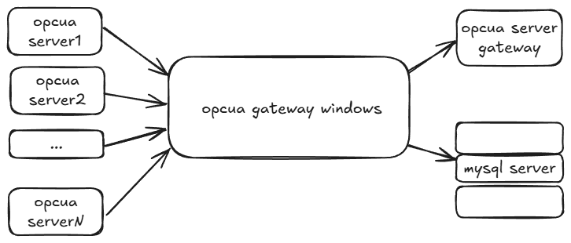
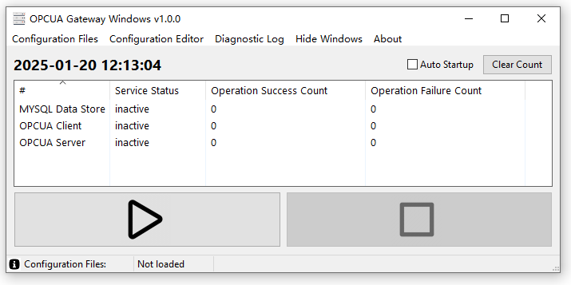
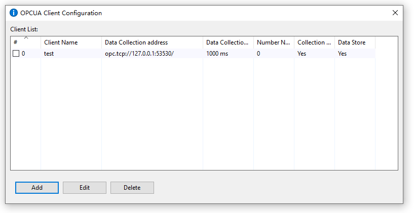
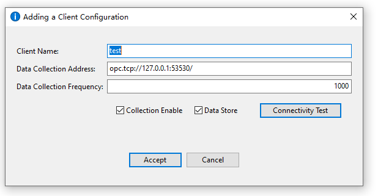
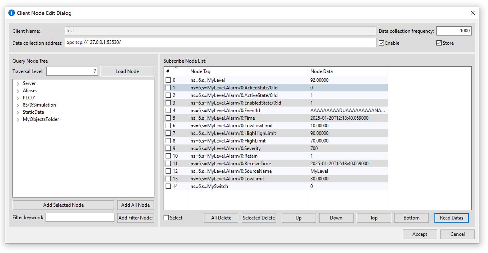
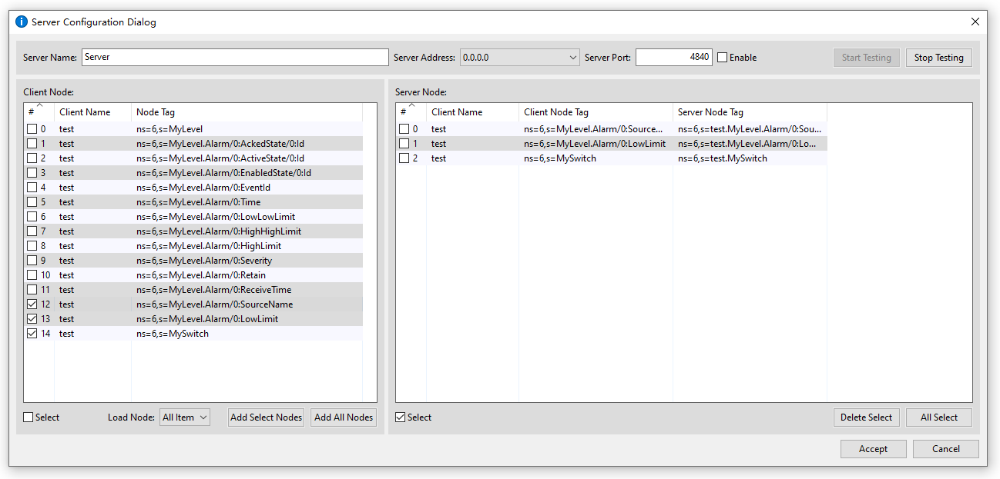
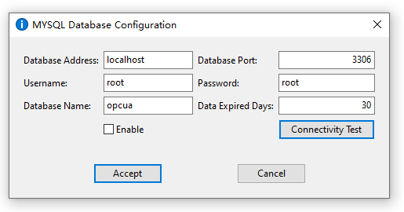

# OPCUA 网关服务程序

## 软件版本 v1.0

## 1. 架构说明

该OPCUA 网关服务程序旨在构建一个高效、灵活且功能强大的数据采集和处理系统，以满足工业自动化领域中对 OPCUA 数据源的整合和管理需求。



### 1.1 数据采集层

基于 OPCUA 协议，能够与多个 OPCUA 数据源进行通信。通过主动轮询或事件触发的方式，从各个数据源获取实时数据。这确保了数据的及时性和完整性。

### 1.2 数据存储层

将采集到的数据存储到 MySQL 数据库中。为了适应不同类型和结构的数据，程序支持自动建库建表。根据采集到的数据特征，自动创建合适的数据库结构，包括表名、字段类型和索引等，以提高数据存储和查询的效率。
同时，考虑到数据的时效性，实现了数据过期处理机制。定期清理过期的数据，以节省存储空间并保持数据库的性能。

### 1.3 数据订阅与推送层

支持数据订阅功能，允许其他应用或系统订阅感兴趣的数据。当数据有更新时，及时将更新的数据推送给订阅者，实现实时的数据交互。

### 1.4 数据汇聚与代理层

能够将多个 OPCUA 数据源的数据进行汇聚和整合，代理一个 OPCUA 服务。这意味着外部系统可以通过与这个代理服务进行交互，获取多个数据源的综合数据，而无需分别与每个数据源进行连接和通信，简化了数据访问的复杂性。

### 1.5 网络配置层

用户可以自定义网络地址和端口，以满足不同网络环境和安全策略的要求。这增加了系统的灵活性和可部署性，使其能够适应各种网络架构。

## 2. 编译过程

### 2.1 准备环境

- Windows10/11 64位
- [Golang SDK](https://studygolang.com/dl/golang/go1.23.3.windows-amd64.msi)
- [GCC 编译器](https://jmeubank.github.io/tdm-gcc/download/)

### 2.2 准备工具

```
go install github.com/akavel/rsrc@latest
go install github.com/jteeuwen/go-bindata/...@latest
```

### 2.3 编译

```
.\build.bat
```

## 3. 使用手册

### 3.1 软件主界面概述

本软件界面主要由菜单栏、时间显示区、数据表格、操作按钮和状态提示区组成。



#### 3.1.1 菜单栏

- “Configuration Files”（配置文件）：用于对软件的配置文件进行相关操作。
- “Configuration Editor”（配置编辑器）：提供对配置进行编辑的功能。
- “Diagnostic Log”（诊断日志）：查看软件运行过程中的诊断日志信息。
- “Hide Windows”（隐藏窗口）：可将软件界面进行隐藏。
- “About”（关于）：展示软件的相关版本、作者等基本信息。

#### 3.1.2 时间显示区

位于界面中间，显示当前的准确时间，如 “2025-01-20 12:13:04”。并且支持清理统计技术和自动启动服务的开关。下一次启动生效。

#### 3.1.3 数据表格

表格中包含三行数据，分别对应:

- “MYSQL Data Store”（MySQL 数据存储）：用于展示MYSQL数据库操作的成功或者失败的统计。
- “OPCUA Client”（OPCUA 客户端）：用于展示OPCUA客户端操作的成功或者失败的统计。
- “OPCUA Server”（OPCUA 服务器）：用于展示OPCUA服务端操作的成功或者失败的统计。

当前所有服务状态均为 “inactive”（未激活），操作成功和失败次数均为 0。如果启动状态为 'active'。

#### 3.1.4 操作按钮

左边的按钮是一个黑色的播放三角形图标，可能用于启动或激活相关服务。
右边的按钮是一个灰色的方形图标，其具体功能需进一步探索。

#### 3.1.5 状态提示区

位于界面最下方，显示 “Configuration Files: Not loaded”（配置文件：未加载）。在配置加载成功之后会显示配置文件路径，如果文件发生修改。会有*标记。

### 3.2 客户端配置界面概述

该窗口的主要用途是配置 OPCUA 客户端



#### 3.2.1 客户端配置列表

这是一个表格，用于显示已配置的客户端信息。

- Client Name（客户端名称）：显示客户端的名称，例如 “test”。
- Data Collection address（数据采集地址）：OPCUA服务端地址，例如：“opc.tcp://127.0.0.1:53530/”
- Data Collection Interval（数据采集间隔）：显示为 “1000 ms”，即每秒采集一次数据。
- Number Nodes（节点数量）：显示为 0，表示当前没有节点或相关数据。
- Collection Enable（采集状态）：显示为 “Yes”，表示采集功能处于开启状态。
- Data Store（数据存储）：显示为 “Yes”，表示数据存储功能也处于开启状态。

#### 3.2.2 操作按钮

- Add（添加）：用于添加新的客户端配置。
- Edit（编辑）：用于编辑选中的客户端配置。
- Delete（删除）：用于删除选中的客户端配置。

#### 3.2.3 客户端添加配置

用于设置添加OPCUA客户端配置



- Client Name（客户端名称）：要添加的客户端的名称，用于标识该客户端。
- Data Collection Address（数据采集地址）：要采集的 OPCUA 协议的服务端地址。
- Data Collection Frequency（数据采集频率）：采集一次数据的时间间隔，单位毫秒。
- Collection Enable（启用采集）：复选框已勾选，表示启用数据采集功能。
- Data Store（数据存储）：复选框，表示启用数据存储功能，采集到的数据将被存储。
- Connectivity Test（连接测试）：按钮，用于测试客户端与指定的数据采集地址之间的连接是否正常。

操作按钮：

- Accept（接受）：点击该按钮将保存当前输入的客户端配置信息并添加到客户端列表中。
- Cancel（取消）：点击该按钮将取消当前的添加操作，关闭该窗口且不保存任何配置信息。

### 3.3 客户端节点配置界面描述

用于编辑OPCUA客户端的数据节点配置



#### 3.3.1 顶部区域

- Client Name（客户端名称）：当前客户端的名称。
- Data collection frequency（数据采集频率）：单位毫秒，表示每隔 1000 毫秒采集一次数据。
- Data collection address（数据采集地址）：支持 OPCUA 协议的地址编辑。
- Enable（启用）：复选框，表示启用数据采集。
- Store（存储）：复选框，表示启用数据存储功能。

#### 3.3.2 左侧区域

- Traversal Level（遍历级别）：节点树的遍历深度或层次。
- Load Node（加载节点）：加载服务端节点树。
- Node Tree（节点树结构）：所加载的节点树列表。
- Add Selected Node（添加所选节点）：按钮，用于将在节点树中选中的节点添加到右侧的订阅节点列表中。
- Add All Node（添加所有节点）：按钮，用于将节点树中的所有节点添加到右侧的订阅节点列表中。
- Filter keyword（过滤关键字）：文本框，用于输入关键字来过滤节点。
- Add Filter Node（添加过滤节点）：按钮，根据输入的过滤关键字添加节点。

#### 3.3.3 右侧区域

列出了已订阅的节点信息。

- Node Tag（节点标签）：节点标识，例如 `ns=6,s=MyLevel.Alarm/0:AckedState/0:ld` 等。
- Node Data（节点数据）：节点的数据，如数值、字符串、时间等。例如，“92.00000”、`2025-01-20T12:18:40.059000` 等。

操作按钮：

- Select（选择）：复选框，用于选择节点。
- All Delete（全部删除）：按钮，用于删除所有订阅节点。
- Selected Delete（删除所选）：按钮，用于删除选中的订阅节点。
- Up（上移）：按钮，将选中的节点上移。
- Down（下移）：按钮，将选中的节点下移。
- Top（置顶）：按钮，将选中的节点移到列表顶部。
- Bottom（置底）：按钮，将选中的节点移到列表底部。
- Read Datas（读取数据）：按钮，用于读取节点的数据。

#### 3.3.4 下面区域

操作按钮：

- Accept（接受）：点击该按钮将保存，保存配置信息并相应的客户端。
- Cancel（取消）：点击该按钮将取消，关闭该窗口且不保存任何配置信息。

### 3.4 服务端配置界面概述

配置 OPCUA 服务器的相关参数和节点映射



顶部区域，配置服务端基本信息：

- Server Name（服务器名称）：设置服务器的名称。
- Server Address（服务器地址）：下拉框，服务器监听所有可用的网络接口。
- Server Port（服务器端口）：服务器监听的端口号。
- Enable（启用）：复选框，用于启用或禁用服务器配置。
- Start Testing（开始测试）用于启动服务器的测试功能。
- Stop Testing（停止测试）：用于停止服务器的测试功能。

左侧区域，列出了所有客户端的节点信息：

- Client Name（客户端名称）：客户端名称，说明该节点所属的的客户端。
- Node Tag（节点标签）：客户端节点标识，例如 `ns=6,s=MyLevel”、“ns=6,s=MyLevel.Alarm/0:AckedState/0:ld` 等。

操作按钮和复选框：

- Select（选择）：复选框，用于选择客户端节点。
- Load Node（加载节点）：按钮，用于加载客户端节点。
- Add Select Nodes（添加所选节点）：按钮，将选中的客户端节点添加到右侧的服务器节点列表中。
- Add All Nodes（添加所有节点）：按钮，将所有客户端节点添加到右侧的服务器节点列表中。

右侧区域 - Server Node（服务器节点）：

- Client Name（客户端名称）：同样为 `test`。
- Client Node Tag（客户端节点标签）：显示客户端节点的标识，与左侧客户端节点列表中的内容相对应。
- Server Node Tag（服务器节点标签）：显示服务器节点的标识，例如 `ns=6,s=test.MyLevel.Alarm/0:Source...` 等，这些是服务器上对应的节点标签。

操作按钮和复选框：

- Select（选择）：复选框，用于选择服务器节点。
- Delete Select（删除所选）：按钮，用于删除选中的服务器节点映射。
- All Select（全选）：按钮，用于全选服务器节点。

底部区域：

- Accept（接受）：按钮，保存所做的更改并关闭对话框。
- Cancel（取消）：按钮，取消更改并关闭对话框。

### 3.5 数据库配置界面概述



主要用途是配置MySQL数据库：

- Database Address（数据库地址）：数据库服务器IP地址。
- Database Port（数据库端口）：数据库的默认端口号。
- Username（用户名）：读写数据库的用户名。
- Password（密码）：读写数据库的密码。
- Database Name（数据库名称）：需要连接的数据库名称。
- Data Expired Days（数据过期天数）：表示存储在数据库中的过期天数。

- Enable（启用）：复选框，用于启用或禁用 MySQL 数据库配置（当前未勾选）。
- Connectivity Test（连接测试）：按钮，用于测试与 MySQL 数据库的连接是否正常。

操作按钮：

- Accept（接受）：点击该按钮将保存当前输入的 MySQL 数据库配置信息。
- Cancel（取消）：点击该按钮将取消当前的配置操作，关闭该窗口且不保存任何配置信息。
